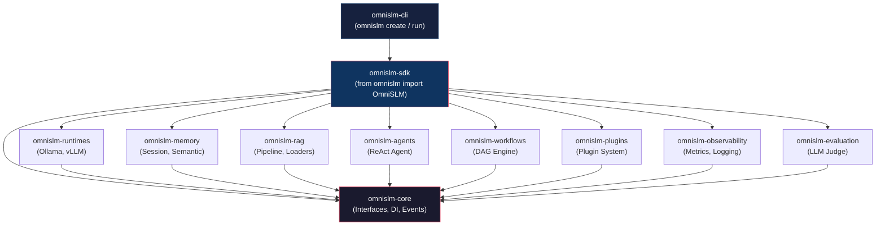
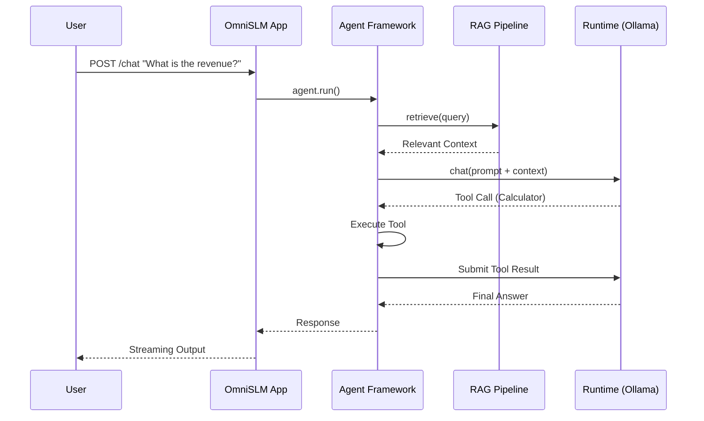

<h1 align="center">OmniSLM</h1>

<p align="center">
  <strong>The modular, open-source AI framework for Small Language Models.</strong><br>
  Build AI assistants, RAG applications, and autonomous agents — locally or self-hosted.
</p>

<p align="center">
  <a href="#why-omnislm">Why OmniSLM?</a> •
  <a href="#features">Features</a> •
  <a href="#quick-start">Quick Start</a> •
  <a href="#architecture">Architecture</a> •
  <a href="#development">Development</a>
</p>

---

## Why OmniSLM?

As AI adoption accelerates, organizations face significant challenges with reliance on cloud-based LLMs:
1. **Data Privacy**: Sending sensitive data to third-party cloud providers creates unacceptable risks.
2. **Vendor Lock-in**: Hardcoding applications against specific APIs limits flexibility and pricing control.
3. **Lack of Extensibility**: Existing local solutions often act as simple wrappers rather than robust, modular frameworks suitable for enterprise integration.

**OmniSLM** solves this by providing a production-grade, API-first framework based on Clean Architecture principles. It allows you to build complex AI applications with a fluent API while maintaining 100% data sovereignty.

---

## Features

- **Multi-Runtime Engine** — Swap between Ollama, vLLM, and llama.cpp with zero code changes.
- **Fluent SDK** — Build applications declaratively with the `OmniSLM` class.
- **RAG Pipeline** — Built-in loaders (PDF, Web, Text), chunkers, embedders, and vector store adapters.
- **Agent Framework** — ReAct agents with autonomous tool execution.
- **Workflow Engine** — DAG-based pipeline execution with topological sorting.
- **Multi-Tier Memory** — Session (Redis/In-memory) and Semantic (Qdrant) recall.
- **Plugin System** — Extend the framework with custom tools, routes, and middleware.
- **CLI Tools** — Scaffold projects, pull models, and manage configuration via `omnislm`.

---

## Quick Start

### 1. Install OmniSLM

Install the core framework and any optional subsystems you need:

```bash
pip install "omnislm[all]"
```

### 2. Scaffold a Project

Use the CLI to generate a new project from a template:

```bash
omnislm create chat-app --name my-ai-app
cd my-ai-app
```

### 3. Build Your Application

OmniSLM provides a fluent builder API. Here is a complete AI server in 6 lines of code:

```python
from omnislm import OmniSLM

app = OmniSLM(name="My AI App", debug=True)
app.enable_memory()
app.enable_rag()
app.enable_agents()
app.install_plugin("calculator")

if __name__ == "__main__":
    app.run()
```

### 4. Run the Server

```bash
omnislm run --reload
```
Access your API at `http://localhost:8000/docs`.

---

## Architecture

OmniSLM is designed as a highly modular monorepo. The framework is strictly decoupled from the application layer.

### Package Ecosystem



### Subsystem Flow



---

## Configuration

Configuration is handled seamlessly via `omnislm.yaml` or environment variables:

```yaml
name: "My Enterprise App"
version: "1.0.0"

runtime:
  default: ollama
  ollama_base_url: http://localhost:11434
  ollama_default_model: "qwen2.5:7b"

memory:
  enabled: true
  backend: redis
  redis_url: redis://localhost:6379/0

rag:
  enabled: true
  vector_store: qdrant
  embedder: sentence-transformers
```

---

## Development

If you want to contribute to the OmniSLM framework itself:

### Setup Monorepo

We provide automated scripts to install all 11 packages in editable mode:

**Windows:**
```cmd
scripts\dev-install.bat
```

**macOS/Linux:**
```bash
chmod +x scripts/dev-install.sh
./scripts/dev-install.sh
```

### Running the Reference App

The framework includes a full reference implementation of an API server in `apps/api-server/`:

```bash
cd apps/api-server
omnislm run
```

---

## License

[Apache License 2.0](LICENSE)

<p align="center">
  Built with ❤️ for the open-source AI community
</p>
