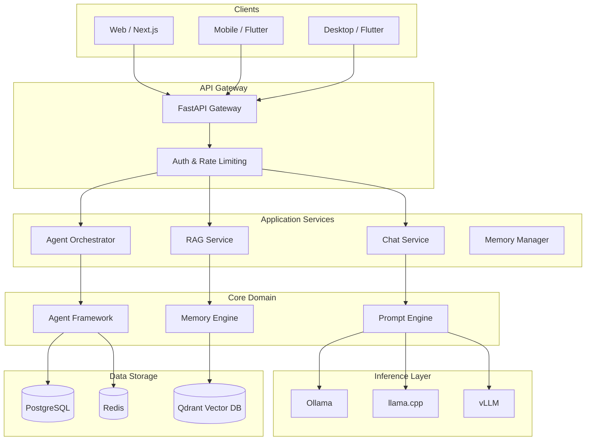
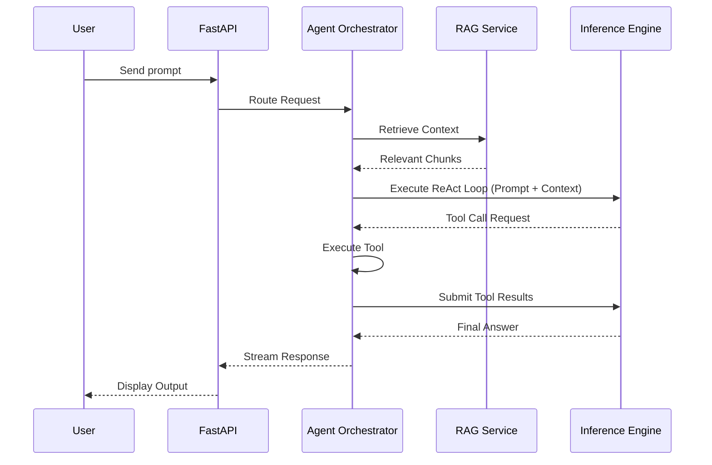
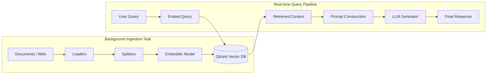

<h1 align="center">OmniSLM</h1>

<p align="center">
  <strong>The open-source AI framework for Small Language Models.</strong><br>
  Build AI assistants, RAG applications, and autonomous agents — locally or self-hosted.
</p>

<p align="center">
  <a href="#problem-statement">Problem</a> •
  <a href="#proposed-solution">Solution</a> •
  <a href="#features">Features</a> •
  <a href="#architecture">Architecture</a> •
  <a href="#quick-start">Quick Start</a>
</p>

---

## Problem Statement

As AI adoption accelerates, organizations face significant challenges with reliance on cloud-based Large Language Models (LLMs):
1. **Data Privacy & Security**: Sending sensitive, proprietary, or regulated data to third-party cloud providers creates unacceptable security risks.
2. **Vendor Lock-in**: Hardcoding applications against specific proprietary APIs (like OpenAI or Anthropic) limits flexibility and pricing control.
3. **High Latency & Costs**: Cloud inference introduces network latency and scaling costs that grow unpredictably with usage.
4. **Lack of Extensibility**: Existing local solutions often act as simple wrappers rather than robust, modular frameworks suitable for enterprise integration.

## Proposed Solution

**OmniSLM** is designed as a foundational, cross-platform Small Language Model (SLM) Framework. Instead of just wrapping an LLM, OmniSLM provides a production-grade backend architecture based on Domain-Driven Design (DDD) and SOLID principles. 

By leveraging local runtimes (Ollama, vLLM, llama.cpp), organizations can:
- **Run AI entirely on-premise** or in private clouds, ensuring 100% data sovereignty.
- **Abstract the inference engine**, allowing developers to swap models and providers seamlessly without rewriting application logic.
- **Deploy complex AI workflows**, natively supporting RAG (Retrieval-Augmented Generation), autonomous ReAct agents, and long-term semantic memory.

---

## Features

- **Multi-Runtime Model Engine** — Ollama, llama.cpp, vLLM, HuggingFace
- **RAG Pipeline** — PDF, DOCX, Web, GitHub → Chunk → Embed → Retrieve → Rerank
- **Agent Framework** — Planner, Research, Coding, Reviewer, Executor agents
- **Tool Calling** — Calculator, file ops, database, REST APIs, custom plugins
- **Workflow Engine** — DAG pipelines, scheduling, agent orchestration
- **4-Tier Memory** — Session, conversation, long-term, user memory
- **Enterprise** — Multi-tenancy, RBAC, OAuth2, audit logs, billing
- **Cross-Platform** — Web (Next.js), Mobile (Flutter), Desktop (Flutter)
- **Observability** — Prometheus metrics, structured logging, OpenTelemetry tracing
- **Deploy Anywhere** — Docker Compose, Kubernetes, or bare metal

## Supported Models

| Family | Models | Parameters |
|--------|--------|------------|
| **Qwen** | Qwen 2.5 | 0.5B – 72B |
| **Gemma** | Gemma 3 | 1B – 27B |
| **Phi** | Phi-4 | 3.8B – 14B |
| **Llama** | Llama 3.2 | 1B – 90B |
| **Mistral** | Mistral 7B, Mixtral | 7B – 47B |

---

## Architecture Diagrams

### 1. System Architecture



### 2. Execution Workflow (Agent ReAct Loop)



### 3. Dataflow (RAG Ingestion & Retrieval)



---

## Quick Start

### Prerequisites

- [Docker](https://docs.docker.com/get-docker/) & Docker Compose
- (Optional) NVIDIA GPU + [NVIDIA Container Toolkit](https://docs.nvidia.com/datacenter/cloud-native/container-toolkit/)

### 1. Clone & Setup

```bash
git clone https://github.com/sudeshsudhii/OmniSLM.git
cd OmniSLM
cp .env.example .env
```

### 2. Start All Services

```bash
docker compose up -d
```

This starts:
- **API Server** → http://localhost:8000
- **Swagger Docs** → http://localhost:8000/docs
- **PostgreSQL** → localhost:5432
- **Redis** → localhost:6379
- **Qdrant** → localhost:6333
- **Ollama** → localhost:11434

### 3. Pull Your First Model

```bash
curl -X POST http://localhost:8000/api/v1/models/pull \
  -H "Authorization: Bearer <your-token>" \
  -H "Content-Type: application/json" \
  -d '{"name": "qwen2.5:3b"}'
```

### 4. Start Chatting

```bash
curl -X POST http://localhost:8000/api/v1/chat/completions \
  -H "Authorization: Bearer <your-token>" \
  -H "Content-Type: application/json" \
  -d '{
    "model": "qwen2.5:3b",
    "messages": [{"role": "user", "content": "Hello!"}],
    "stream": true
  }'
```

---

## Tech Stack

| Layer | Technology |
|-------|-----------|
| Backend | Python 3.11+, FastAPI, SQLAlchemy 2.0, Pydantic v2 |
| Database | PostgreSQL 16, Redis 7, Qdrant |
| Event Bus | Celery, Redis Pub/Sub |
| AI | Ollama, llama.cpp, vLLM, SentenceTransformers |
| Frontend | Next.js 14+ |
| Mobile/Desktop | Flutter |
| DevOps | Docker, Kubernetes, GitHub Actions |
| Observability | Prometheus, structlog, OpenTelemetry |

---

## Roadmap

- [x] **Phase 1**: MVP — Model engine, chat API, auth, Docker
- [x] **Phase 2**: Memory + RAG pipeline infrastructure
- [x] **Phase 3**: Agent framework + workflows and tooling
- [x] **Phase 4**: Event-Driven Architecture and Observability
- [ ] **Phase 5**: Advanced MLOps and Evaluation UI
- [ ] **Phase 6**: AI ecosystem (marketplace, mobile/desktop apps)

## Future Enhancements

As the platform scales into a full SaaS offering, the following enhancements are planned:
1. **Multi-Agent Orchestration**: Native support for swarm intelligence and hierarchical agent structures (e.g., AutoGen, CrewAI style orchestrations).
2. **No-Code Workflow Builder**: A visual drag-and-drop web UI to assemble pipelines, map inputs/outputs, and attach tools to agents.
3. **Advanced RAG Capabilities**: Integration with GraphRAG (Knowledge Graphs) and hybrid keyword/semantic search paradigms (BM25 + Cosine).
4. **Continuous Evaluation (LLMOps)**: Automated A/B testing of prompts, synthetic data generation for fine-tuning, and robust LLM-as-a-judge dashboards.

---

## Development

```bash
# Install dependencies
pip install poetry
poetry install

# Run locally
make dev

# Run tests
make test

# Lint & format
make lint
make format
```

## Contributing

We welcome contributions! Please read [CONTRIBUTING.md](CONTRIBUTING.md) before submitting PRs.

## License

[Apache License 2.0](LICENSE)

---

<p align="center">
  Built with ❤️ for the open-source AI community
</p>
